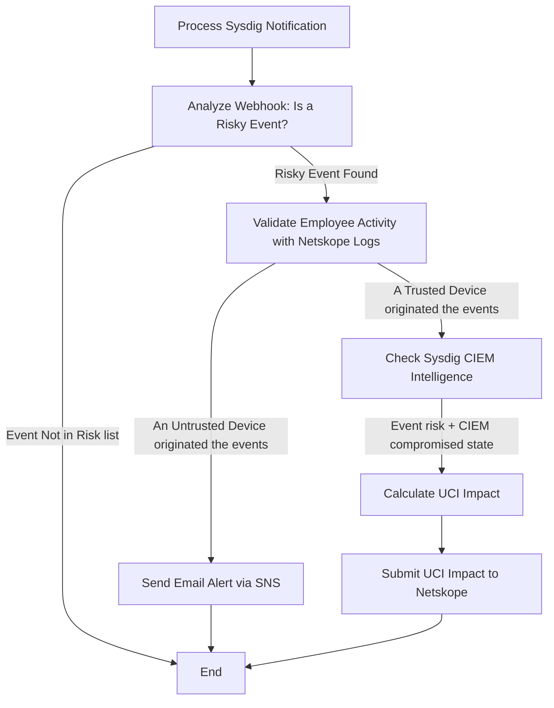

# Sysdig Webhook Handler for Netskope

This integration compare signals from Sysdig CDR and Netskope SASE to detect risky operations in the cloud, find out if they come from trusted or untrusted devices, block them with Netskope if they are originated from an employee's computer (risky employee or potential computer hijacking), or alert if they are coming from an untrusted device (potential intrusion / stolen credentials).

## Important considerations and prerequisites

- [Sysdig](https://sysdig.com) CDR connected to a cloud account (it has been tested with AWS so far) and an API Token (preferably associated to a service account)
- [Netskope](https://www.netskope.com/products/secure-access-service-edge) SASE with [UCI](https://docs.netskope.com/en/behavior-analytics-user-confidence-index/) and an API V2 token. Create and configure a [Real-Time Protection policy](https://docs.netskope.com/en/inline-policies/) for UCI-driven responses like user blocking.
- AWS IAM identities must be email centric or the script will be unable to match IAM with Netskope user identities.
- The script use an array of important events to decide which particular Sysdig findings will trigger the automation and what would be the UCI penalty.
- A needle string is used to try to identify if the events were originated from a trusted device, this feature provide an interesting new source of evidences for real time automations, but it is not meant to be perfect.

## Instructions

### Configure the script
Configure the array `sysdig_findings`:
- Set `sysdig_findings.penalty` with the desired UCI penalty values (default values are just references).
- Fine tune `sysdig_findings.netskp` with the appropriate Netskope needles strings to match findings between Sysdig and Netskope.
- Add new elements to the array to increase the coverage.  

   ```
      sysdig_findings = [
         {"name":"Delete Bucket Public Access Block", "penalty":350, "netskp":"s3"},
         ...
      ]
   ```

### Deploy the script 
1. IAM
   1. Roles > Create Role
   2. Trusted entity type: AWS Service, Service or use case: Lambda
   3. Select these two AWS managed policies: AmazonS3ReadOnlyAccess and AmazonSNSFullAccess
   4. 
2. SNS
   1. Create a new topic, select Standard
   2. Annotate the ARN for later
   3. Create subscription with the desired e-mail address to receive alerts (confirm subscription e-mail)
3. Lambda
   1. Create the Lambda function
   2. Set environment variables
   3. Annotate the Lambda HTTP endpoint and create Sysdig Notifications (webhooks) to trigger it.
4. Environment variables   

      ```
         netskope_token="<NETSKOPE-TOKEN>"
         netskope_url="<NETSKOPE-API-URL>"
         sysdig_token="<SYSDIG-TOKEN>"
         sysdig_url="<SYSDIG-URL>"
         securityToken="<LAMBDA-TOKEN-OPTIONAL>"
         snsarn="<TOPIC-ARN>"
      ```

## Sample commands for local testing

`python-lambda-local -t 15 -f lambda_handler lambda_function.py events/detect-aws-s3-versioning-disabled.json`

`python-lambda-local -t 15 -f lambda_handler lambda_function.py events/aws-cloudtrail-deleted.json`

# Architecture

## Diagram



## How a trusted device is identified?

The `sysdig_findings` array contains not only the CDR events from Sysdig that we consider specially risky, but also the strings that hook those Sysdig findings with Netskope SASE user logs (under development at this moment).
If the Netskope API show events that match with the hook fields, the script will consider that the CDR event was originated from a trusted device. Please note that the level of evidence is not perfect but enough to motivate an investigation with high confidency.
